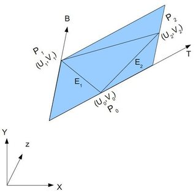

## 法线贴图

法线贴图使用一个图像文件，该图像文件包含在光照下所期望表面外观的法向量。在法线贴图中，向量相对于任意平面 XY 表示，其中 X 与 Y 表示与垂直的偏差，其 Z 分量设置为 1，严格垂直于 XY 平面的分量将表示为 (0,0,1)，而不垂直的向量的 X、Y 分量不全为 0。因为向量的偏移范围为 [-1 1]，而 RGB 值的范围为 [0 1]，需要进行映射。

### 切向量空间

我们已经知道了一个点的法线，怎么构造出切向量空间呢？定义一组基需要三个向量，N 已经知道了，我们还需要计算T 和 B。

切线和法线垂直，但这样的切线有很多个。这么多切线中该选哪个呢？理论上哪一个都行。但我们必须保持连续一致性，以免衔接处出现瑕疵。标准的做法是将切线方向和纹理空间对齐, T 和 U 对齐，B 和 V 对齐。

<p align="center">
  
</p>

算法如下：记三角形的两条边为 deltaPos1 和 deltaPos2（对应图中的 E1 和 E2），deltaUV1 和 deltaUV2 是对应的 UV 坐标下的差值；则问题可用如下方程表示：

```cpp
deltaPos1 = deltaUV1.x * T + deltaUV1.y * B
deltaPos2 = deltaUV2.x * T + deltaUV2.y * B
```

求解 T 和 B 就得到了切线和副切线！把 T 和 B 看成一个整体，利用高斯消元就可以解出 T 和 B。

```cpp
float r = 1.0f / (deltaUV1.x * deltaUV2.y - deltaUV1.y * deltaUV2.x);
glm::vec3 tangent = (deltaPos1 * deltaUV2.y   - deltaPos2 * deltaUV1.y)*r;
glm::vec3 bitangent = (deltaPos2 * deltaUV1.x   - deltaPos1 * deltaUV2.x)*r;
```

已知T、B、N向量之后，按列排列成一个矩阵，该矩阵可以完成从切线空间到相机空间/世界空间的变换。很明显，用这个矩阵乘以原来的 N ，就可以得到扰动后的法向量。

