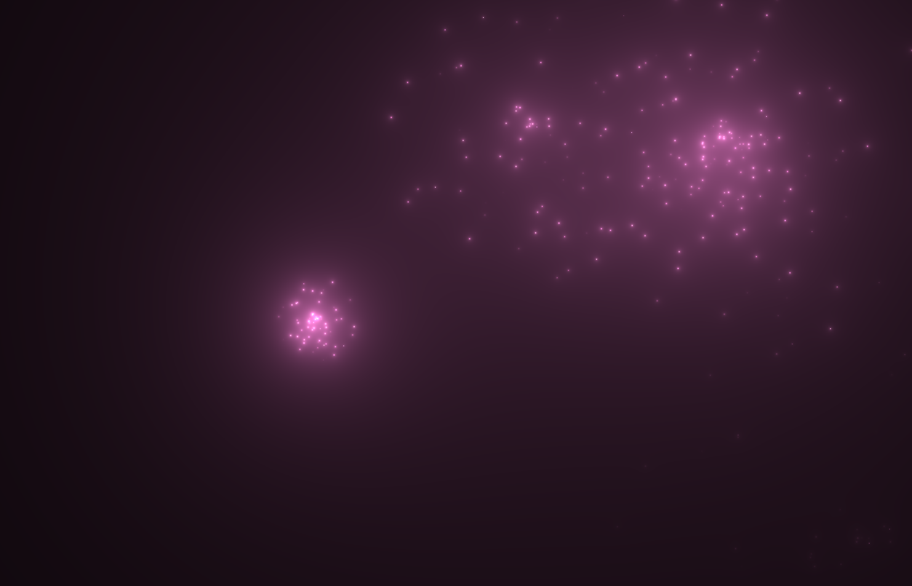

## 烟花效果

```cpp
#define NUM_EXPLOSIONS 5.0
#define NUM_PARTICLES 75.0

// 基本思路 在原点产生多个点 为每个点生成一个随机的方向
// 每个点随着时间朝着设定的方向前进
// 每个点光线有一个衰减函数，其表达式为1/d d为距点的距离
// 当前像素的亮度有所有点来决定

vec2 hash12(float t){
    float x = fract(sin(t*674.3)*453.2);
    float y = fract(sin((x+t)*714.3)*263.2);
    return vec2(x,y);
}

vec2 hash12Polar(float t){
    float a = fract(sin(t*674.3)*453.2)*6.2832;
    float d = fract(sin((a+t)*714.3)*263.2);
    return vec2(sin(a),cos(a))*d;
}

float explosion(vec2 uv, float t){
    float sparks = 0.0;
    for(float i = 0.0;i<NUM_PARTICLES;i++){
        vec2 dir = hash12Polar(i+1.0)*0.5; // i=0时，得到的数字永远为0 跳过这个值
        float d = length(uv - dir*t);
        float brightness = mix(0.0005,0.002,smoothstep(0.05,0.0,t));
        brightness *= sin(t*20.0 + i) * 0.5 + 0.5; //闪烁效果
        brightness *= smoothstep(1.0, 0.75, t); //亮度随着时间消失
        sparks += brightness / d;
    }
    return sparks;
}

void mainImage(out vec4 fragColor, in vec2 fragCoord){
    vec2 uv = (fragCoord - 0.5*iResolution.xy)/iResolution.y;
    vec3 col = vec3(0);

    // 一秒钟一轮
    for(float i=0.0;i<NUM_EXPLOSIONS;i++){
        float t = iTime + i / NUM_EXPLOSIONS; // 让每个烟花分散开
        float ft = floor(iTime); //随机数种子
        vec2 offs = hash12(i + 1.0 + ft) - 0.5;
        vec3 color = sin(4.0 * vec3(0.34,0.54,0.43) * floor(iTime)) * 0.25 + 0.75;
        offs *= vec2(1.77, 1.0); // 变成长方形
        col += explosion(uv-offs,fract(t)) * color;
    }
    fragColor = vec4(col,1.0);
}
```

<p align="center">
  
</p>