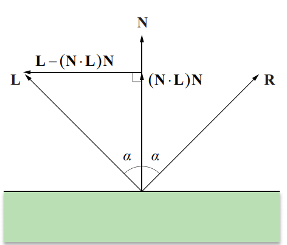

## 反射与折射向量

在计算过程中需要注意方向，L 的方向是从反射/折射点指向光源，并且 N 和 L 均为单位长度向量。

### 反射向量计算

<p align="center">
  
</p>

一束光线照射在一个反射面上，其反射光线的方向遵循一个简单的规律，即入射角等于反射角。

$$
R=2(N \cdot L)N - L
$$

```cpp
vec3 reflect(vec3 l,  vec3 n) {
    return 2.0f*dot(n,l)*n - l;
}
```

### 折射向量计算

透射表面具有折射系数属性，根据 Snell 定律，入射角$$\theta_L$$和折射角$$\theta_T$$之间的关系如下式所示。

$$
\eta_L\sin \theta_L = \eta_T\sin \theta_T 
$$

<p align="center">
  
</p>

T的表达式如下。

$$
T = \left (\frac{\eta_L}{\eta_T}N \cdot L - \sqrt{1-\frac{\eta_L^2}{\eta_T^2}[1-(N\cdot L)^2]} \right)N-\frac{\eta_L}{\eta_T}L
$$

```cpp
// Snell's law
vec3 refract(const vec3 &I, const vec3 &N, const float eta_t, const float eta_i=1.f) { 
    float cosi = - std::max(-1.f, std::min(1.f, dot(I,N)));
    // if the ray comes from the inside the object, swap the air and the media
    if (cosi<0) return refract(I, -N, eta_i, eta_t); 
    float eta = eta_i / eta_t;
    float k = 1 - eta*eta*(1 - cosi*cosi);
    // k<0 = total reflection, no ray to refract.
    // I refract it anyways, this has no physical meaning
    return k<0 ? vec3(1,0,0) : I*eta + N*(eta*cosi - sqrtf(k)); 
}
```